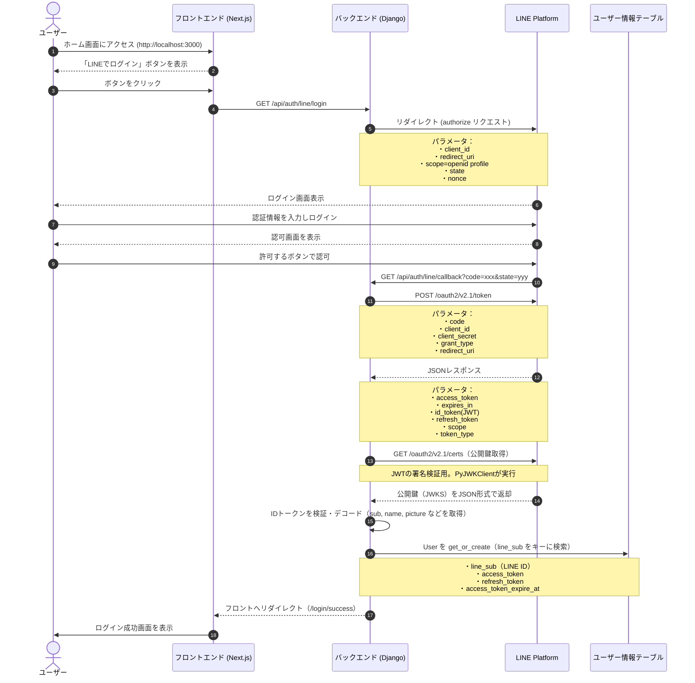

```mermaid
sequenceDiagram
    autonumber
    actor User as ユーザー
    participant FE as フロントエンド (Next.js)
    participant BE as バックエンド (Django)
    participant LINE as LINE Platform
    participant DB as ユーザー情報テーブル

    User ->> FE: ホーム画面にアクセス (http://localhost:3000)
    FE -->> User: 「LINEでログイン」ボタンを表示

    User ->> FE: ボタンをクリック
    FE ->> BE: GET /api/auth/line/login

    BE ->> LINE: リダイレクト (authorize リクエスト)
    note over BE,LINE: パラメータ：<br>・client_id<br>・redirect_uri<br>・scope=openid profile<br>・state<br>・nonce

    LINE -->> User: ログイン画面表示

    User ->> LINE: 認証情報を入力しログイン
    LINE -->> User: 認可画面を表示

    User ->> LINE: 許可するボタンで認可

    LINE ->> BE: GET /api/auth/line/callback?code=xxx&state=yyy

    BE ->> LINE: POST /oauth2/v2.1/token
    note over BE,LINE: パラメータ：<br>・code<br>・client_id<br>・client_secret<br>・grant_type<br>・redirect_uri

    LINE -->> BE: JSONレスポンス
    note over BE,LINE: パラメータ：<br>・access_token<br>・expires_in<br>・id_token(JWT)<br>・refresh_token<br>・scope<br>・token_type

    BE ->> LINE: GET /oauth2/v2.1/certs（公開鍵取得）
    note over BE,LINE: JWTの署名検証用。PyJWKClientが実行
    LINE -->> BE: 公開鍵（JWKS）をJSON形式で返却

    BE ->> BE: IDトークンを検証・デコード（sub, name, picture などを取得）

    BE ->> DB: User を get_or_create（line_sub をキーに検索）
    note over BE,DB: ・line_sub（LINE ID）<br>・access_token<br>・refresh_token<br>・access_token_expire_at


    BE -->> FE: フロントへリダイレクト（/login/success）

    FE ->> User: ログイン成功画面を表示

```